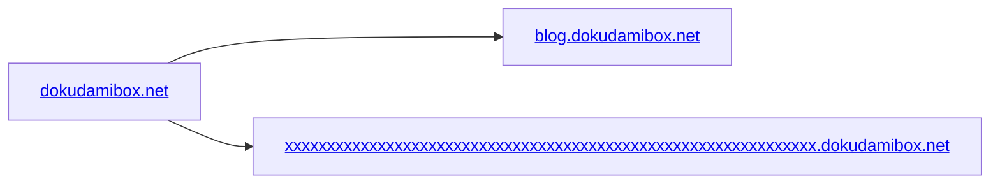

# dokudamibox.net

```mermaid
flowchart LR
    root["<a href='https://dokudamibox.net'>dokudamibox.net</a>"]
    links["<a href='https://links.dokudamibox.net'>blog.dokudamibox.net</a>"]
    x63["<a href='https://xxxxxxxxxxxxxxxxxxxxxxxxxxxxxxxxxxxxxxxxxxxxxxxxxxxxxxxxxxxxxxx.dokudamibox.net'>xxxxxxxxxxxxxxxxxxxxxxxxxxxxxxxxxxxxxxxxxxxxxxxxxxxxxxxxxxxxxxx.dokudamibox.net</a>"]

    root --> links
    root --> x63
```
